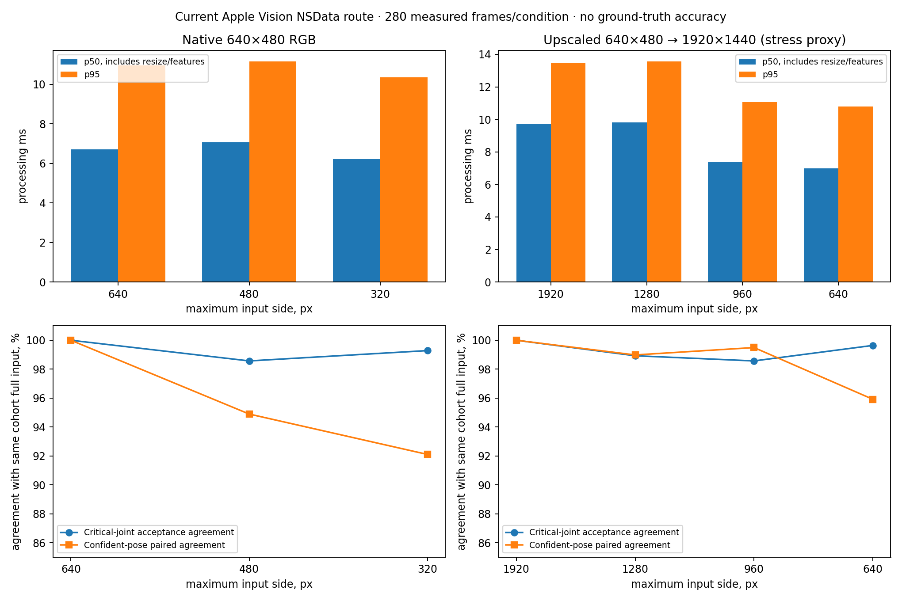

# Повторная оценка задержки, 9 октября 2026

**Рабочий Apple Vision backend и исходное разрешение остаются рекомендуемыми defaults.** Снижение максимальной стороны до 960 px заслуживает опциональной настройки и проверки пользователем. Замена backend ради WiLoR/MLX сейчас не обоснована. Самое безопасное подтверждённое улучшение — не загружать неиспользуемый Torch temporal model при запуске стабильного режима.

## Измерение текущего маршрута

Изолированный M2 Pro, Python 3.14, текущий `NativeVisionHands` с **нативной копией NSData** и `CGDataProviderCreateWithCFData`. Камера и GUI были закрыты; ОС события не отправлялись. Полные версии, macOS, Vision revision и SHA256 файла backend: `results.json`. Всего 2240 запросов; 1960 после исключения первых5 кадров каждого условия/клипа/ориентации.280 измеренных кадров на условие. МаксимальныйRSS процесса изолированного benchmark сохранён в JSON; это не тест долговременной памяти.

Все 40 доступных public IPN Hand clips имеют 640×480, см. `input-inventory.json`. Выбраны первые сортированные видео четырёх разных участников, 40 последовательных кадров вокруг середины каждого, исходная и горизонтально отражённая RGB картинка. `native640` — реальное разрешение файлов. `upscale1920` — увеличение тех же картинок до1920×1440 кубической интерполяцией **для нагрузки на conversion/request**, а не настоящая камера1920 или новая детализация. Нативного high-resolution public clip среди локальных данных нет; новые данные не скачивались.

Порядок разрешений чередуется на соседних кадрах. У каждого условия свой tracker и `ImagePoseLatch`; timestamps 30 fps. Downsample INTER_AREA, aspect ratio сохранён; upscaling только при создании stress-input, вне timing. `route_ms` включает безопасную конверсию+native request+извлечение суставов; `total_ms` дополнительно включает downsample+FrameFeatures+ImagePoseLatch. Decode, capture, render, controller dwell, OS delivery и GUI scheduling исключены. Измеренная processing latency не равна end-to-end задержке движения курсора.

| Вход / max_side | route p50/p95, ms | total p50/p95, ms | Критические суставы accepted /280 | Совпадение presence | Совпадение уверенной позы (пар) | Pointer displacement p95, source px |
|---|---:|---:|---:|---:|---:|---:|
| native640 /640 |6.35/10.39|6.70/10.96|209|100%|100% (203)|0|
| native640 /480 |6.14/9.87|7.06/11.14|207|98.57%|94.90% (196)|2.63|
| native640 /320 |5.88/9.64|6.22/10.35|209|99.29%|92.11% (190)|5.72|
| upscale1920 /1920 |9.15/12.73|9.74/13.47|208|100%|100% (199)|0|
| upscale1920 /1280 |7.34/10.93|9.82/13.55|207|98.93%|98.98% (197)|1.48|
| upscale1920 /960 |6.64/10.18|7.41/11.08|208|98.57%|99.49% (198)|2.13|
| upscale1920 /640 |6.00/9.62|6.99/10.80|209|99.64%|95.92% (196)|3.03|



В stress-cohort 960 уменьшаетtotal p50 примерно 24%, p95 — 18%.1280 уменьшает native request, но INTER_AREA resize занимает около 2 ms, поэтому полного выигрыша здесь нет.640 ускоряет ещё немного, но увеличивает разногласия позы. Native640→480 проигрываетпоtotal;320 даёт небольшой выигрыш с заметно худшим pose agreement. Присутствие одинакового числа рук не означает одинаковые accepted frames.

**Показатели качества — прокси относительно результата того же API при полном входе, не accuracy/recall.** Accepted означает текущие critical joints0,5,8,9 confidence≥.25 и допустимые координаты; низкоуверенные некритические суставы не отвергают руку целиком. Poseagreement считается только при принятой руке и определённой позе обоих `ImagePoseLatch` (его operationalconfidence=.9; не калиброванная вероятность). Между суставами displacement считается только для конечных координат и confidence≥.25 у обоих вариантов. Pointer — сырой midpoint wrist/middle-MCP, до controller/filter/screen mapping. Единицыsource px 640×480; это не пиксели рабочего стола. Полная выборка и обе ориентации есть в `timings.csv`, `landmarks.json`, `orientation-summary.json`; показатели не являются разметкой намерения жеста или handedness. Upscale не доказывает сохранность мелких пальцев, далёких рук, плохого освещения на настоящей1920×1080камере. Один boundedrun не измеряет thermal/session tails; ранние пять кадров каждого условия исключены, но запуск первого native request всё равно может быть медленнее. Размеры benchmark 4:3; живая камера16:9 требует повторной проверки.

## Запуск, imports и память

`startup_probe.py` создаёт свежий subprocess для каждого из трёх повторов; измеряется import+constructor, без Qt window/камеры. Файловые caches не очищались, поэтому «cold» здесь означает новый Python process, не reboot.

| Сценарий | medianseconds | medianpeakRSS, MiB | Torch загружен |
|---|---:|---:|---|
| importgesture_system.gui |0.117|54.8|нет|
| importtorch |0.567|196.9|да|
| Engine(load_models=False) |0.040|26.0|нет|
| Engine(default) |0.573|199.1|да|

Baseline `Engine` загружает существующий streaming checkpoint даже с выключенным experimental_neural; стабильная ветвь `process` сразу возвращает события `StableController`. Источник затрат — constructor, а не импорт gui. Рекомендуется создавать Engine стабильного GUI с `load_models=False`, сохранив явную загрузку для экспериментального режима; перед любой будущей lazy-loading реализацией сохранить semantics injected predictor, reset, checkpoint failure и отсутствие silent model fallback. Это убирает около 0.53 с и 173 MiB в изолированном constructor; нельзя обещать те же числа для полного приложения. Product code этим исследованием не изменён.

## Что изучено повторно

- [Apple hand pose sample](https://developer.apple.com/documentation/vision/detecting-hand-poses-with-vision) и [maximumHandCount](https://developer.apple.com/documentation/vision/vndetecthumanhandposerequest/maximumhandcount): RGB 2D landmarks встроены в OS, текущий count 1 уже ограничивает работу. Нет измеренного основания менять synchronous request или ownership. Прямой Pythonbytes provider отвергнут: ранее воспроизведена утечка полного RGBA frame на установленном Python/PyObjC. Исторический `reports/implementation-audit/vision_probe.py` использовал этот небезопасныйprovider; его timing не принят текущим baseline.
- [MediaPipe Python guide](https://developers.google.com/edge/mediapipe/solutions/vision/hand_landmarker/python): VIDEO/LIVE_STREAM используют tracking, избегая palm detector на каждом кадре; LIVE_STREAM отдаёт callback и игнорирует новый frame, если busy. Это реальная альтернатива RGB; world landmarks не являются измеренной physical depth. Текущий app требует иной confidence contract и повторной проверки поз/двусторонности. [Проект](https://github.com/google-ai-edge/mediapipe) Apache2.0. Новый сравнительный backendbenchmark в этой итерации не выполнен; старые measurements не смешиваются с новым NSData route.
- [WiLoR paper](https://arxiv.org/abs/2409.12259) и [official implementation](https://github.com/christianmonfiston/wilor): реконструкция monocular3D/mesh решает более тяжёлую задачу, чем стабильное2Dуправление. OfficialREADME сообщает CC-BY-NC-ND для моделей, отдельные условия MANO/Ultralytics; перенос в продукт требует отдельной проверки лицензий.
- [WiLoR-mini](https://github.com/warmshao/WiLoR-mini): simplified inference wrapper, automatic weights download; README ориентируется на Python 3.10 и CUDA/CPU. Это не подтверждение малой задержки на нынешнем M2 Pro / Python 3.14.
- [WiLoR-MLX](https://github.com/lyonsno/wilor-mlx): перспективныйApple Silicon port, авторская current README даёт49ms saved-frame full route на M4 Max; это чужая сцена/железо, не сопоставимая локальная метрика. Firstsetup требует порядка 2.4 GB pose weights + 107 MB detector и отдельной MANO конверсии. README заявляетMIT для port code/weights, однако upstream условия и MANO нужно оценивать отдельно. Не скачивали и не запускали. Для текущего 2D режима сложность и размер и отсутствие собственного измерения перевешивают пользу; оставить отдельнымнаправлением для 3D исследований.

## Рекомендации и повторение

1. Оставить native Apple Vision, safe NSData owner, maxHandCount 1, критическийconfidence contract, ImagePoseLatch, отсутствиеphysical depth и исходное разрешение по умолчанию.
2. Добавить необязательныйmax_side 960 с ясной пометкойexperimental и возвратом кoriginal;1280 не рекомендовать как гарантированное ускорение. При переносе native coordinates сохранять исходный aspect и исходныйframe_size для downstream; не растягивать картинку.
3. Отдельно улучшить startup отключением eager unused temporal model. Не снижатьconfirmation/dwell ради небольшогоbenchmark speedup: это другая задача latency / false events.
4. Перед изменением default повторить на реальных native camera 1920×1080 кадрах, у обоих рук, на point/victory/navigation/pinch; сохранить кадры только с согласия пользователя. Нужны unintended action count, dropout, cursor jitter, sustained memory иactual packet age, а не толькоmodel time.

Команды из корня репозитория (камера/GUI остановлены во времяnativebenchmark):

```sh
.venv/bin/python reports/optimization-20261009/benchmark.py
.venv/bin/python reports/optimization-20261009/startup_probe.py
MPLCONFIGDIR=/tmp/gesture-opt-mpl .venv/bin/python reports/optimization-20261009/plot_results.py
```

`benchmark.py` требует разрешённого macOS native GPU request; внутри ограниченной sandbox CVPixelBuffer может быть запрещён. Скрипты не открывают камеру, окна и не публикуют OS input. Запуск third party source programs/installers отсутствовал. Источники проверены 2026-10-09; никакие новые зависимости не установлены.
